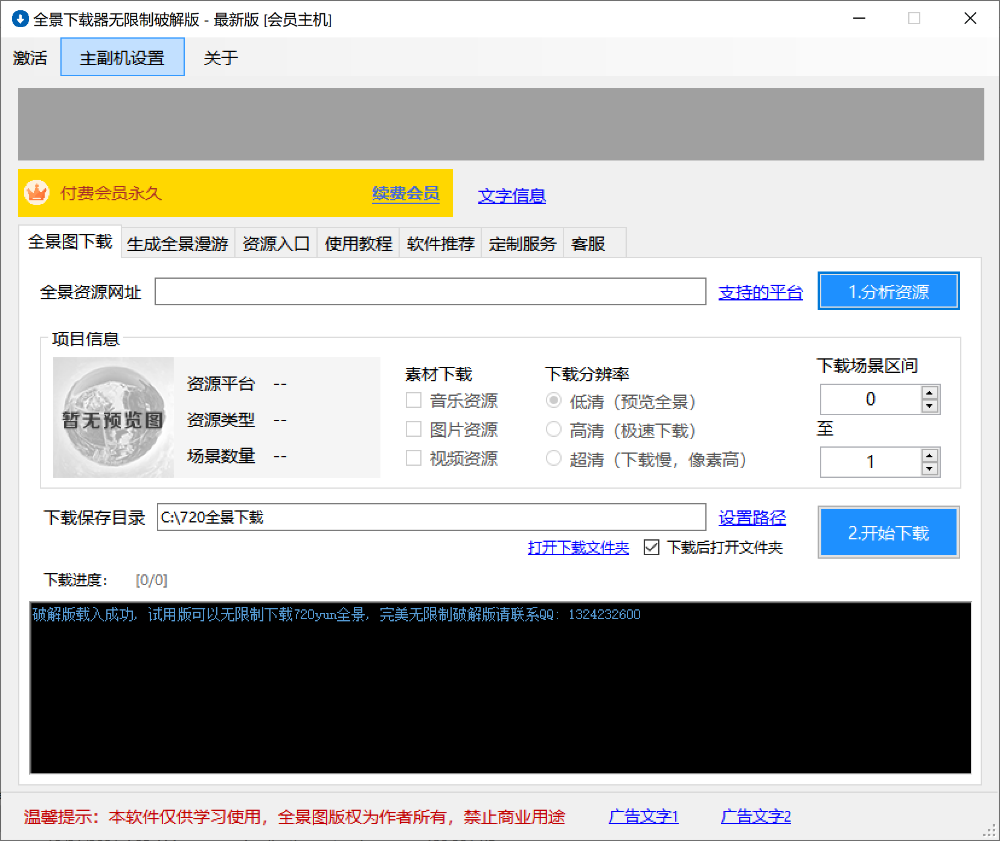

## 介绍

### 先上下载链接： 
解压后双击KDCrackRealease.exe， 下方显示破解载入成功则说明成功了

https://wwz.lanzoue.com/iq9cD0h7nvnc   密码6rrw

也可以在Github Release Page里面下载： https://github.com/crackleeeessyp/krpano-download-crack/releases/tag/1.0.0

### 最终破解效果

### 背景介绍
朋友找我下载一些网站的全景图，之前都是手动处理的，比较麻烦，上次已经破解了一款全景图下载软件，今天在网上又看到另一款软件，试用了下只能下载低分辨率，并且偶尔卡死，但基本可以下，本来想买一个，一看价格放弃了，只能上家伙自己破解了：

### 主要修改
- 去除了烦人的广告和一些使用上的限制 

- 该软件会大量搜集用户的隐私电脑的信息，包括一些安装软件信息（你电脑里是否装了AutoDesk，Visual Studio都会采集，非常恶心，如下图所示），还有硬件CPU，内存信息等，然后全部上传到远程服务器 http://kudianapp.com/api/api_kd.php ，不清楚会不会被倒卖给广告商。这里破解后把后台服务器给干掉了，强制指向本地127.0.0.1，这样隐私信息就不会被上传到远程服务器了

- 去除了机器的限制

欢迎一些破解爱好者讨论，如果想要讨论破解方案可以联系QQ

By
YP韩

